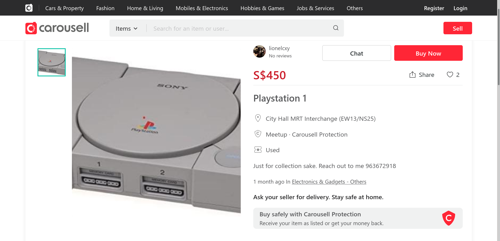
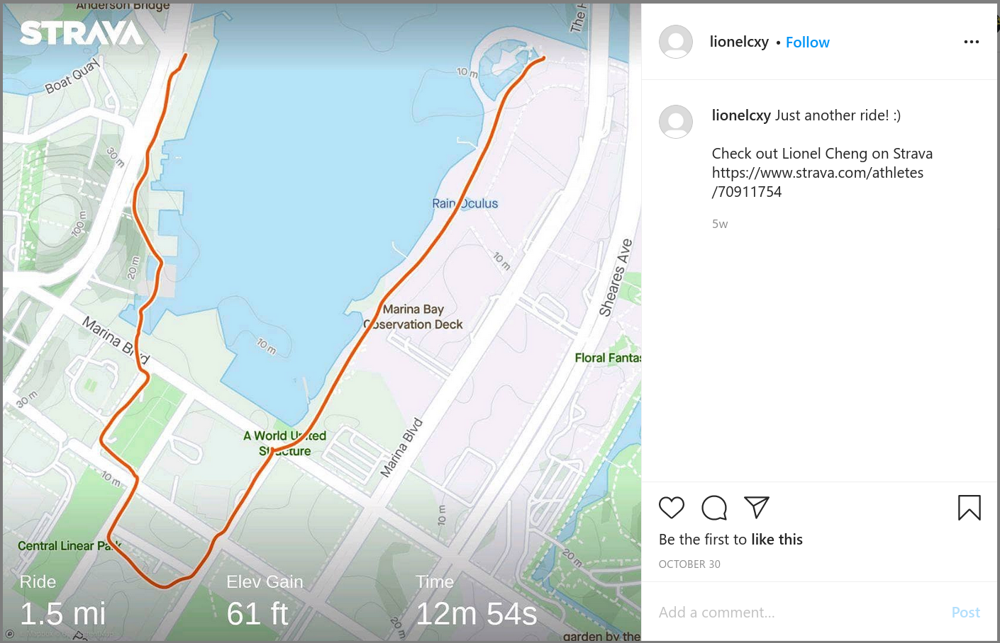
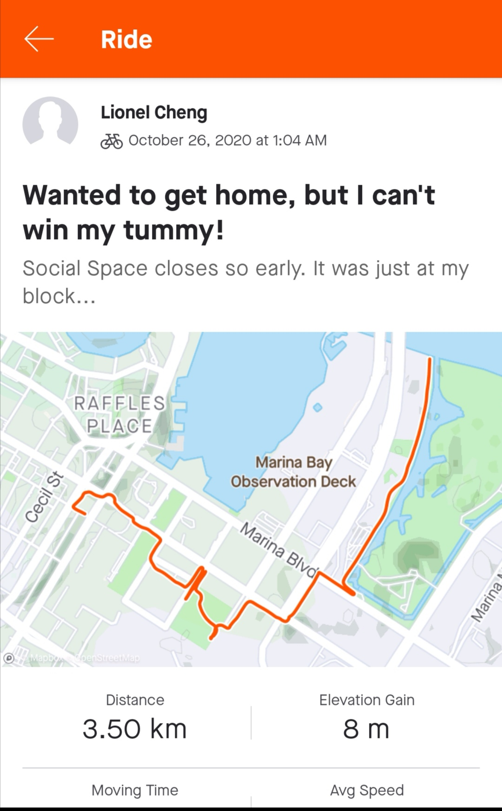
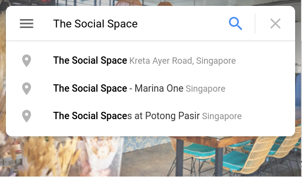

# OSINT-Challenge-8: Hunt him down!

### Description

> After solving the  past two incidents, COViD sent a death threat via email today. Can you  help us investigate the origins of the email and identify the suspect  that is working for COViD? We will need as much information as possible  so that we can perform our arrest! 
>
> Example Flag: govtech-csg{JohnLeeHaoHao-123456789-888888} 
>
> *Flag Format: govtech-csg{fullname-phone number[9digits]-residential postal code[6digits]}* 

### Solution

First, we open up the `eml` file. (Doing a quick google search, we can also see that a `eml` file is a file format developed by Microsoft for Outlook and Outlook Express, but this information is not necessary to solve this problem.)

```
X-Pm-Origin: internal
X-Pm-Content-Encryption: end-to-end
Subject: YOU ARE WARNED!
From: theOne <theOne@c0v1d.cf>
Date: Fri, 4 Dec 2020 21:27:07 +0800
Mime-Version: 1.0
Content-Type: multipart/mixed;boundary=---------------------9d9b7a65470a533c33537323d475531b
To: cyberdefenders@panjang.cdg <cyberdefenders@panjang.cdg>

-----------------------9d9b7a65470a533c33537323d475531b
Content-Type: multipart/related;boundary=---------------------618fd3b1e5dbb594048e34eeb9e9fcdb

-----------------------618fd3b1e5dbb594048e34eeb9e9fcdb
Content-Type: text/html;charset=utf-8
Content-Transfer-Encoding: base64

PGRpdj5USEVSRSBXSUxMIEJFIE5PIFNFQ09ORCBDSEFOQ0UuIEJFIFBSRVBBUkVELjwvZGl2Pg==
-----------------------618fd3b1e5dbb594048e34eeb9e9fcdb--
-----------------------9d9b7a65470a533c33537323d475531b--
```

Hmm...the email contents looks like it's encoded in `Base64`. Let's try decoding it:

```python
>>> import base64
>>> base64.b64decode('PGRpdj5USEVSRSBXSUxMIEJFIE5PIFNFQ09ORCBDSEFOQ0UuIEJFIFBSRVBBUkVELjwvZGl2Pg==')
b'<div>THERE WILL BE NO SECOND CHANCE. BE PREPARED.</div>'
```

Okay, that looks pretty useless. The hex encoded strings is unlikely to contain useful information either; they may be signatures or hashes specified by the format, and if you try decode them you will see that they are just gibberish. (Note: the `X-Pm-Origin: internal`and `X-Pm-Content-Encryption: end-to-end` headers are useless here either, and from google searches appear to be associated with protonmail.) What other useful information can there be in an email then?

That's right, the email headers. In this case, since we are hunting for someone, perhaps the sender/receipient information could be useful. Let's take a look.

```
From: theOne <theOne@c0v1d.cf>
...
To: cyberdefenders@panjang.cdg <cyberdefenders@panjang.cdg>
```

Instinctively, we put the two email addresses through a bunch of online email reverse searches, but sadly, that turned on nothing useful. But there must be no other way, because this is the only information in the file that has not be proven useless (unlike the `Base64` encoded message body).

After staring long and hard at the addresses, it struck us suddenly that perhaps the domains could be useful. There must be a way to store some information to move on to the next step of the problem (or the flag). So let's try pinging `c0v1d.cf` and `panjang.cdg`:

```
$ ping c0v1d.cf
PING c0v1d.cf (127.0.0.1) 56(84) bytes of data.
...
$ ping panjang.cdg
ping: panjang.cdg: Name or service not known
```

...and that didn't work. So, we know they won't lead us to servers. Unfortunate indeed. But this showed us something interesting: `c0v1d.cf` is registered! This is unlikely to be a coincidence. Is there any other way we can store information in a DNS record? Yes! **TXT records** can be used. You can read a full explanation [here](https://www.cloudflare.com/learning/dns/dns-records/dns-txt-record/). In brief,

>The DNS ‘text’ (TXT) record lets a [domain](https://www.cloudflare.com/learning/dns/glossary/what-is-a-domain-name/) administrator enter text into the [Domain Name System (DNS)](https://www.cloudflare.com/learning/dns/what-is-dns/).
>The TXT record was originally intended as a place for human-readable 
>notes. However, now it is also possible to put some machine-readable 
>data into TXT records. One domain can have many TXT records.

Let's go ahead and try extracting the TXT records for `c0v1d.cf` then.

```sh
$ dig TXT c0v1d.cf

; <<>> DiG 9.11.22-RedHat-9.11.22-1.fc31 <<>> TXT c0v1d.cf
;; global options: +cmd
;; Got answer:
;; ->>HEADER<<- opcode: QUERY, status: NOERROR, id: 49559
;; flags: qr rd ra; QUERY: 1, ANSWER: 1, AUTHORITY: 0, ADDITIONAL: 1

;; OPT PSEUDOSECTION:
; EDNS: version: 0, flags:; udp: 4096
;; QUESTION SECTION:
;c0v1d.cf.			IN	TXT

;; ANSWER SECTION:
c0v1d.cf.		3600	IN	TXT	"user=lionelcxy contact=lionelcheng@protonmail.com"

;; Query time: 573 msec
;; SERVER: 192.168.1.254#53(192.168.1.254)
;; WHEN: Thu Dec 10 22:41:06 +08 2020
;; MSG SIZE  rcvd: 99
```

Nice! We got a credential: `user=lionelcxy contact=lionelcheng@protonmail.com` (which coincidentally or not, matches our earlier guess that protonmail is involved. While interesting, this is not important :P). The next step is obvious: let's google the username and email addresses on various social media sites to see if we can find out more about this lionel person.

Using his email, we find his [LinkedIn profile](https://sg.linkedin.com/in/cheng-xiang-yi-0a4b891b9).


So his full name is **Lionel Cheng Xiang Yi**.

Using his username, we find his [Carousell](https://www.carousell.sg/lionelcxy/) and [Instagram](https://www.instagram.com/lionelcxy/) accounts. On his Carousell, we find a few listings. Going through them, we realise the playstation one gives us what we want :)



Aha, so his phone number is **963672918**. Now, let's check the instagram.



Here, we can try both endpoints of his cycling route since that might (unlikely) be his home address. Nope, that didn't work. Let's dive deeper into his Strava account then, which he conveniently linked us to. Clicking on the first post, we see



Did we see Social Spaces is just at his block? Perfect, let's check out the postal code of that using Google Maps!



There's a few social spaces. Of course we can try all of them, but let's try to guess intelligently: from his cycling activity posted on instagram, the one located Marina One seems more likely. Clicking on it, we see that the postal code is **018935**. Putting every thing together, we have a guess for the flag. And that happens to be the correct one!

Flag: `govtech-csg{LionelChengXiangYi-963672918-018935}`
